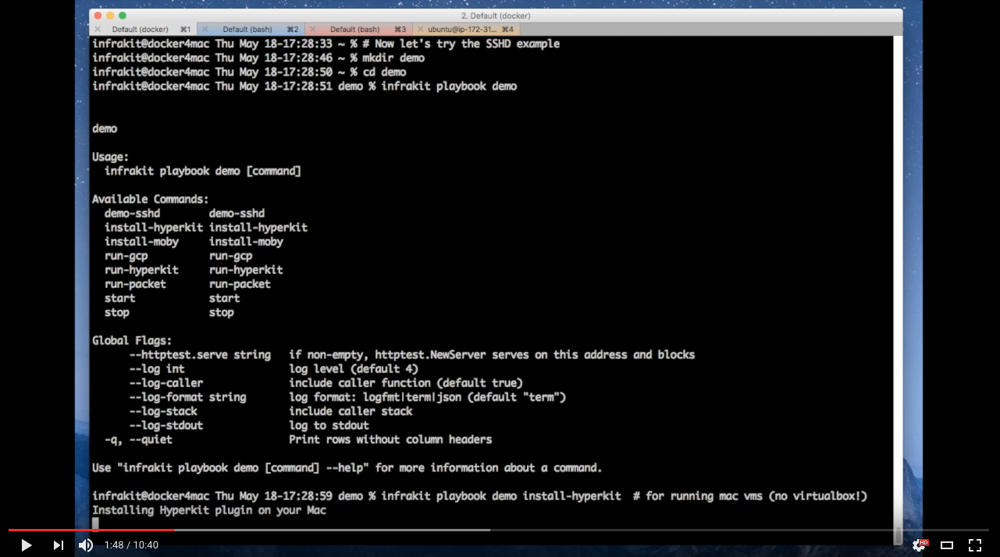

InfraKit
========
[](https://circleci.com/gh/docker/infrakit/tree/master)
<!--
[](https://circleci.com/gh/docker/infrakit)
-->
[](https://goreportcard.com/report/github.com/docker/infrakit)
<!--
[](https://codecov.io/github/docker/infrakit?branch=master)
-->

_InfraKit_ is a toolkit for infrastructure orchestration.
With an emphasis on immutable infrastructure, it breaks down infrastructure automation and management processes into small, pluggable components.
These components work together to actively ensure the infrastructure state matches the user's specifications.
InfraKit therefore provides infrastructure support for higher-level container orchestration systems and can make your infrastructure self-managing and self-healing.

To get started, try the [tutorial](docs/tutorial/README.md), or check out the video below:

### InfraKit + [LinuxKit](https://github.com/linuxkit/linuxkit) POC

[](https://www.youtube.com/watch?v=j50ovfRWpZM "InfraKit + LinuxKit")

In this video, InfraKit was used to build a custom linux operating system (based on [linuxkit](https://github.com/linuxkit/linuxkit)).
We then deployed a cluster of virtual machine instances on a local Mac laptop using the Mac Xhyve hypervisor (HyperKit). A cluster
of 3 servers booted up in seconds.  Later, after the custom OS image has been updated with a new public key, InfraKit detects the
change and orchestrates a rolling update of the nodes.
We then deploy the same OS image to a bare-metal ARM server running on [Packet.net](https://packet.net), where the server uses
custom ipxe boot directly from the localhost.  It demonstrates some of the key concepts and components in InfraKit and shows how
InfraKit can be used to implement an integrated workflow from custom OS image creation to cluster deployment and Day N management.
The entire demo is published as a [playbook](docs/playbooks/README.md), and you can create your own playbooks too.

### Use Cases

_InfraKit_ is designed to automate setup and management of infrastructure in support of distributed systems and higher-level
container orchestration systems.  Some of the use cases we are working on include:

  + Bootstrap / installation of container orchestration systems like Docker Swarm and Kubernetes
  + Cluster autoscaler that can work across a variety of platforms from public clouds (like AWS autoscaling groups) to
  bare-metal hosts.
  + GPU cluster provisioning
  + Integration with LinuxKit for building and deploying immutable infrastructure from declarative specifications of the entire stack:
  from infrastructure resources to os / kernel and applications.
  + Day-N management and automation of infrastructure - from provisioning to rolling updates and capacity scaling.

InfraKit has a modular architecture with a set of interfaces which define the interactions of these 'plugin objects'.
Plugins are active daemons that cooperate with one another to ensure the infrastructure state matches your specifications.


## Plugins
_InfraKit_ makes extensive use of _Plugins_ to manage arbitrary systems in diverse environments, which can be composed
to meet different needs. See the [plugins](docs/plugin) documentation for more technical details.

Here is a list of plugins:

### Core Implementations

| plugin                                                  | type     | description                             |
|:--------------------------------------------------------|:---------|:----------------------------------------|
| [group](./pkg/plugin/group)                             | group    | core group controller for rolling updates, scale group, etc. |
| [swarm](./pkg/plugin/flavor/swarm/README.md)            | flavor   | runs Docker in Swarm mode               |
| [kubernetes](./pkg/plugin/flavor/kubernetes/README.md)  | flavor   | bootstraps a single master kubernetes cluster    |
| [combo](./pkg/plugin/flavor/combo)                      | flavor   | [combine multiple flavor plugins](./docs/plugin/flavor/combo/README.md) |
| [vanilla](./pkg/plugin/flavor/vanilla)                  | flavor   | [manual specification of instance fields](./docs/plugin/flavor/vanilla/README.md) |
| [aws](./pkg/provider/aws)                               | instance | creates Amazon EC2 instances and other resource types |
| [digitalocean](./pkg/provider/digitalocean)             | instance | creates DigitalOcean droplets             |
| [docker](./pkg/provider/docker)                         | instance | [provisions container via Docker](./pkg/provider/docker/README.md)         |
| [google](./pkg/provider/google/plugin/instance)         | instance | [Google Cloud Platform compute instances](./pkg/provider/google/README.md) |
| [file](./pkg/plugin/instance/file)                      | instance | useful for development and testing      |
| [hyperkit](./pkg/provider/hyperkit)                     | instance | creates [HyperKit](https://github.com/moby/hyperkit) VMs on Mac OSX |
| [libvirt](./pkg/provider/libvirt)                       | instance | provisions KVM vms via libvirt          |
| [maas](./pkg/provider/maas)                             | instance | [bare-metal provisioning using Ubuntu MAAS](./pkg/provider/maas/plugin/instance/README.md)  |
| [packet](./pkg/provider/packet)                         | instance | provisions bare metal hosts on Packet   |
| [rackhd](./pkg/provider/rackhd)                         | instance | [bare-metal server provisioning via RackHD](./pkg/provider/rackhd/README.md) |
| [terraform](./pkg/provider/terraform/instance)          | instance | creates resources using Terraform       |
| [vagrant](./pkg/provider/vagrant)                       | instance | creates Vagrant VMs                     |
| [vsphere](./pkg/provider/vsphere)                       | instance | creates VMWare VMs                     |

### Community Implementations

| plugin                                                  | type     | description                             |
|:--------------------------------------------------------|:---------|:----------------------------------------|
| [HewlettPackard/infrakit-instance-oneview](https://github.com/HewlettPackard/infrakit-instance-oneview)      | instance    | bare-metal server provisioning via HP-OneView |
| [IBM Cloud](./pkg/provider/terraform/instance) | instance    | Provisions instances on IBM Cloud via terraform             |
| [AliyunContainerService/infrakit.aliyun](https://github.com/AliyunContainerService/infrakit.aliyun) | instance    | Provisions instances on Alibaba Cloud |
| [1and1/infrakit-instance-oneandone](https://github.com/1and1/infrakit-instance-oneandone) | instance    | Provisions instances on 1&1 Cloud Server |
| [sacloud/infrakit-instance-sakuracloud](https://github.com/sacloud/infrakit.sakuracloud) | instance    | Provisions instances on Sakura Cloud |

Have a Plugin you'd like to share?  Submit a Pull Request to add yourself to the list!


## Building
### Your Environment

Make sure you check out the project following a convention for building Go projects. For example,

```shell

# Install Go - https://golang.org/dl/
# Assuming your go compiler is in /usr/local/go
export PATH=/usr/local/go/bin:$PATH

# Your dev environment
mkdir -p ~/go
export GOPATH=!$
export PATH=$GOPATH/bin:$PATH

mkdir -p ~/go/src/github.com/docker
cd !$
git clone git@github.com:docker/infrakit.git
cd infrakit
```

We recommended go version 1.9 or greater for all platforms.

Also install a few build tools:
```shell
make get-tools
```

### Running tests
```shell
$ make ci
```

### Binaries
```shell
$ make binaries
```
Executables will be placed in the `./build` directory.  There is only one executable `infrakit` which can
be used as CLI and as server, based on the CLI verbs and flags.

# Design

## Configuration
_InfraKit_ uses JSON for configuration because it is composable and a widely accepted format for many
infrastructure SDKs and tools.  Since the system is highly component-driven, our JSON format follows
simple patterns to support the composition of components.

A common pattern for a JSON object looks like this:

```json
{
   "SomeKey": "ValueForTheKey",
   "Properties": {
   }
}
```

There is only one `Properties` field in this JSON and its value is a JSON object. The opaque
JSON value for `Properties` is decoded via the Go `Spec` struct defined within the package of the plugin --
for example -- [`vanilla.Spec`](examples/flavor/vanilla/flavor.go).

The JSON above is a _value_, but the type of the value belongs outside the structure.  For example, the
default Group [Spec](pkg/plugin/group/types/types.go) is composed of an Instance plugin, a Flavor plugin, and an
Allocation:

```json
{
  "ID": "name-of-the-group",
  "Properties": {
    "Allocation": {
    },
    "Instance": {
      "Plugin": "name-of-the-instance-plugin",
      "Properties": {
      }
    },
    "Flavor": {
      "Plugin": "name-of-the-flavor-plugin",
      "Properties": {
      }
    }
  }
}
```
The group's Spec has `Instance` and `Flavor` fields which are used to indicate the type, and the value of the
fields follow the pattern of `<some_key>` and `Properties` as shown above.

The `Allocation` determines how the Group is managed.  Allocation has two properties:
  - `Size`: an integer for the number of instances to maintain in the Group
  - `LogicalIDs`: a list of string identifiers, one will be associated with each Instance

Exactly one of these fields must be set, which defines whether the Group is treated as 'cattle' (`Size`) or 'pets'
(`LogicalIDs`).  It is up to the Instance and Flavor plugins to determine how to use `LogicalID` values.

As an example, if you wanted to manage a Group of NGINX servers, you could
write a custom Group plugin for ultimate customization.  The most concise configuration looks something like this:

```json
{
  "ID": "nginx",
  "Plugin": "my-nginx-group-plugin",
  "Properties": {
    "port": 8080
  }
}
````

However, you would likely prefer to use the default Group plugin and implement a Flavor plugin to focus on
application-specific behavior.  This gives you immediate support for any infrastructure that has an Instance plugin.
Your resulting configuration might look something like this:

```json
{
  "ID": "nginx",
  "Plugin": "group",
  "Properties": {
    "Allocation": {
      "Size": 10
    },
    "Instance": {
      "Plugin": "aws",
      "Properties": {
        "region": "us-west-2",
        "ami": "ami-123456"
      }
    },
    "Flavor": {
      "Plugin": "nginx",
      "Properties": {
        "port": 8080
      }
    }
  }
}
```

Once the configuration is ready, you will tell a Group plugin to
  + watch it
  + update it
  + destroy it

Watching the group as specified in the configuration means that the Group plugin will create
the instances if they don't already exist.  New instances will be created if for any reason
existing instances have disappeared such that the state doesn't match your specifications.

Updating the group tells the Group plugin that your configuration may have changed.  It will
then determine the changes necessary to ensure the state of the infrastructure matches the new
specification.

## Docs

Additional documentation can be found [here](docs).

## Reporting security issues

The maintainers take security seriously. If you discover a security issue,
please bring it to their attention right away!

Please **DO NOT** file a public issue, instead send your report privately to
[security@docker.com](mailto:security@docker.com).

Security reports are greatly appreciated and we will publicly thank you for it.
We also like to send gifts—if you're into Docker schwag, make sure to let
us know. We currently do not offer a paid security bounty program, but are not
ruling it out in the future.


## Design goals

_InfraKit_ is currently focused on supporting setup and management of base infrastructure, such as a cluster
orchestrator.  The image below illustrates an architecture we are working towards supporting - a Docker cluster in Swarm
mode.


This configuration co-locates _InfraKit_ with Swarm manager nodes and offers high availability of _InfraKit_ itself and
Swarm managers (using attached storage).  _InfraKit_ is shown managing two groups - managers and workers that will be
continuously monitored, and may be modified with rolling updates.

Countless configurations are possible with _InfraKit_, but we believe achieving support for this configuration will
enable a large number of real-world use cases.

## Copyright and license

Copyright © 2016 Docker, Inc. All rights reserved. Released under the Apache 2.0
license. See [LICENSE](LICENSE) for the full license text.
