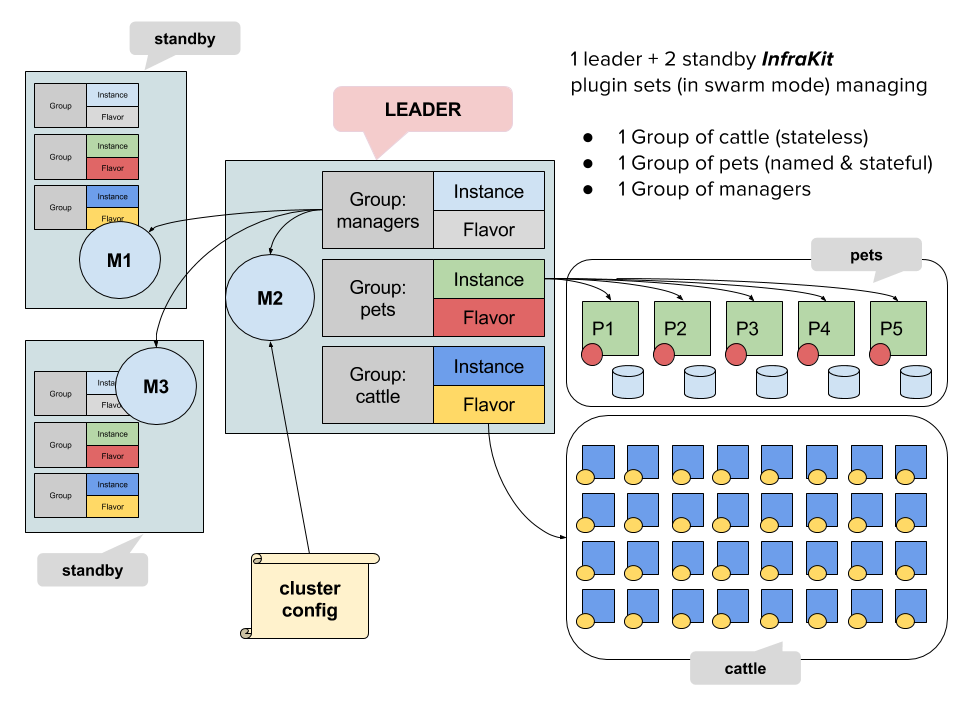

InfraKit
========

[](https://circleci.com/gh/docker/infrakit)
[](https://codecov.io/github/docker/infrakit?branch=master)

_InfraKit_ is a toolkit for creating and managing declarative, self-healing infrastructure.
It breaks infrastructure automation down into simple, pluggable components. These components work together to actively
ensure the infrastructure state matches the user's specifications.
Although _InfraKit_ emphasizes primitives for building self-healing infrastructure, it also can be used passively like conventional tools.



To get started, try the [tutorial](docs/tutorial.md).

## Overview

### Plugins
_InfraKit_ at the core consists of a set of collaborating, active processes.  These components are called _plugins_.  

_InfraKit_ supports composing different plugins to meet different needs.  These plugins are active controllers that
can look at current infrastructure state and take action when the state diverges from user specification.

Initially, we implement these plugins as servers listening on unix sockets and communicate using HTTP.  By nature, the
plugin interface definitions are language agnostic so it's possible to implement a plugin in a language other than Go.
Plugins can be packaged and deployed differently, such as Docker containers.

Plugins are the active components that provide the behavior for the primitives that _InfraKit_ supports. These primitives
are described below.


### Groups, Instances, and Flavors

_InfraKit_ supports these primitives: groups, instances, and flavors.  They are active components running as _plugins_.

#### Groups
When managing infrastructure like computing clusters, Groups make good abstraction, and working with groups is easier
than managing individual instances. For example, a group can be made up of a collection
of machines as individual instances. The machines in a group can have identical configurations (replicas, or cattle).
They can also have slightly different properties like identity and ordering (as members of a quorum or pets).

_InfraKit_ provides primitives to manage Groups: a group has a given size and can shrink or grow based on some specification,
whether it's human generated or machine computed.
Group members can also be updated in a rolling fashion so that the configuration of the instance members reflect a new desired
state.  Operators can focus on Groups while _InfraKit_ handles the necessary coordination of Instances.

Since _InfraKit_ emphasizes on declarative infrastructure, there are no operations to move machines or Groups from one
state to another.  Instead, you _declare_ your desired state of the infrastructure.  _InfraKit_ is responsible
for converging towards, and maintaining, that desired state.

Therefore, a [group plugin](spi/group/spi.go) manages Groups of Instances and exposes the operations that are of interest to
a user:

  + watch/ unwatch a group (start / stop managing a group)
  + inspect a group
  + trigger an update the configuration of a group - like changing its size or underlying properties of instances. 
  + stop an update
  + destroy a group

##### Default Group plugin
_InfraKit_ provides a default Group plugin implementation, intended to suit common use cases.  The default Group plugin
manages Instances of a specific Flavor.  Instance and Flavor plugins can be composed to manage different types of
services on different infrastructure providers.

While it's generally simplest to use the default Group plugin, custom implementations may be valuable to adapt another
infrastructure management system.  This would allow you to use _InfraKit_ tooling to perform basic operations on widely
different infrastructure using the same interface.

| plugin| description                  |
|:------|:-----------------------------|
| [infrakit/group](./cmd/group) | supports Instance and Flavor plugins, rolling updates |


#### Instances
Instances are members of a group. An [instance plugin](spi/instance/spi.go) manages some physical resource instances.
It knows only about individual instances and nothing about Groups.  Instance is technically defined by the plugin, and
need not be a physical machine at all.


| plugin| description                  |
|:------|:-----------------------------|
|[infrakit/file](./example/instance/file)   | A simple plugin for development and testing.  Uses a local disk file as instance. |
|[infrakit/terraform](./example/instance/terraform) | A plugin to provision using Terraform |
|[infrakit/vagrant](./example/instance/vagrant) | A plugin that provisions Vagrant VMs |


For compute, for example, instances can be VM instances of identical spec. Instances
support the notions of attachment to auxiliary resources.  Instances are taggable and tags are assumed to be persistent
which allows the state of the cluster to be inferred and computed.

In some cases, instances can be identical, while in other cases the members of a group require stronger identities and
persistent, stable state. These properties are captured via the _flavors_ of the instances.

#### Flavors
Flavors help distinguish members of one group from another by describing how these members should be treated.
A [flavor plugin](spi/flavor/spi.go) can be thought of as defining what runs on an Instance.
It is responsible for dictating commands to run services, and check the health of those services.

Flavors allow a group of instances to have different characteristics.  In a group of cattle,
all members are treated identically and individual members do not have strong identity.  In a group of pets,
however, the members may require special handling and demand stronger notions of identity and state.

| plugin| description                  |
|:------|:-----------------------------|
| [vanilla](plugin/flavor/vanilla) | A vanilla flavor that lets you configure by user data and labels |
| [zookeeper](plugin/flavor/zookeeper) | For handling of zookeeper ensemble members |
| [swarm](plugin/flavor/swarm) | configures instances with Docker in Swarm mode |


## Building

### Your Environment

Make sure you check out the project following a convention for building Go projects. For example,

```shell

# Install Go - https://golang.org/dl/
# Assuming your go compiler is in /usr/local/go
export PATH=/usr/local/go/bin:$PATH

# Your dev environment
mkdir -p ~/go
export GOPATH=!$
export PATH=$GOPATH/bin:$PATH

mkdir -p ~/go/src/github.com/docker
cd !$
git clone git@github.com:docker/infrakit.git
cd infrakit

```

Also install a few tools

```shell
go get -u github.com/kardianos/govendor  # the dependency manager
go get -u github.com/golang/lint/golint  # if you're running tests
```
Now you are ready to go.

### Running tests
```shell
$ make ci
```

### Binaries
```shell
$ make -k infrakit
```
This will create a directory, `infrakit` in the project directory.  The executables can be found here.
Currently, several binaries are available. More detailed documentations can be found here

  + [`infrakit/cli`](./cmd/cli/README.md), the command line interface
  + [`infrakit/group`](./cmd/group/README.md), the default [group plugin](./spi/group)
  + [`infrakit/file`](./example/instance/file), an instance plugin using files
  + [`infrakit/terraform`](./example/instance/terraform), an instance plugin integrating [Terraform](https://www.terraform.io)
  + [`infrakit/vagrant`](./example/instance/vagrant), an instance plugin using vagrant
  + [`infrakit/vanilla`](./example/flavor/vanilla), a flavor plugin for plain vanilla set up with user data and labels
  + [`infrakit/zookeeper`](./example/flavor/zookeeper), a flavor plugin for zookeeper ensemble members
  + [`infrakit/swarm`](./example/flavor/swarm), a flavor plugin for Docker Swarm managers and workers.


## Examples
There are few examples of _InfraKit_ plugins:

  + Terraform Instance Plugin
    - [README](./example/instance/terraform/README.md)
    - [Code] (./example/instance/terraform/plugin.go) and [configs](./example/instance/terraform/aws-two-tier)
  + Zookeeper / Vagrant
    - [README](./example/flavor/zookeeper/README.md)
    - [Code] (./plugin/flavor/zookeeper)


# Design

## Configuration
_InfraKit_ uses JSON for configuration because it is composable and widely accepted format for many
infrastructure SDKs and tools.  Because the system is highly components-driven, our JSON format follow
simple patterns to support composition of components.

A common pattern for a JSON value looks like this:

```json
{
   "SomeKey": "ValueForTheKey",
   "Properties": {
   }
}
```

There is only one `Properties` field in this struct and its value is a another raw JSON value. The opaque
JSON value for `Properties` is decoded via the Go `Spec` struct defined within the package of the plugin --
for example -- [`vanilla.Spec`](/plugin/flavor/vanilla/flavor.go).

The JSON above is a _value_, but the type of the value belongs outside the structure.  For example, the
default Group [Spec](/plugin/group/types/types.go) is composed of one instance and one flavor plugin:

```json
{
    "ID": "name-of-the-group",
    "Properties": {
        "Instance": {
           "Plugin": "name-of-the-instance-plugin",
           "Properties": {
           }
        },
        "Flavor": {
           "Plugin": "name-of-the-flavor-plugin",
           "Properties": {
           }
        }
    }
}
```
The group's Spec has `Instance` and `Flavor` fields which are used to indicate the type, and the value of the
fields follow the pattern of `<some_key>` and `Properties` as shown above.

As an example, if you wanted to manage a Group of NGINX servers, you could
write a custom Group plugin for ultimate customizability.  The most concise configuration looks something like this:

```json
{
  "ID": "nginx",
  "Plugin": "my-nginx-group-plugin",
  "Properties": {
    "port": 8080
  }
}
````

However, you would likely prefer to use the default Group plugin and implement a Flavor plugin to focus on
application-specific behavior.  This gives you immediate support for any infrastructure that has an Instance plugin.
Your resulting configuration might look something like this:

```json
{
  "ID": "nginx",
  "Plugin": "group",
  "Properties": {
    "Instance": {
      "Plugin": "aws",
      "Properties": {
        "region": "us-west-2",
        "ami": "ami-123456"
      }
    },
    "Flavor": {
      "Plugin": "nginx",
      "Properties": {
        "size": 10,
        "port": 8080
      }
    }
  }
}
```

Once the configuration is ready, you will tell a Group plugin to
  + watch it
  + update it
  + destroy it

Watching the group as specified in the configuration means that the Group plugin will create
the instances if they don't already exist.  New instances will be created if for any reason
existing instances have disappeared such that the state doesn't match your specifications.

Updating the group tells the Group plugin that your configuration may have changed.  It will
then determine the changes necessary to ensure the state of the infrastructure matches the new
specification.

## Plugin Discovery

_InfraKit_ plugins collaborate with each other to accomplish a set of objectives.  Therefore, they
need to be able to talk to one another.  While many different discovery methods are available, this
toolkit implements a simple file-based discovery system the names of the unix socket files in a common
directory represents the _name_ of the plugin.

By default the common directory for unix sockets is located at `/run/infrakit/plugins`.
Make sure this directory exists on your host:

```
mkdir -p /run/infrakit/plugins
chmod 777 /run/infrakit/plugins
```

Note that a plugin's name is separate from the _type_ of the plugin, so it's possible to have two
_file_ instance plugins running but with different names and configurations (for
what they _provision_ or the content they write to disk).  For example:

```
$ infrakit/file --listen=unix:///run/infrakit/plugins/another-file.sock --dir=./test
INFO[0000] Starting plugin
INFO[0000] Listening on: unix:///run/infrakit/plugins/another-file.sock
INFO[0000] listener protocol= unix addr= /run/infrakit/plugins/another-file.sock err= <nil>
```

List the plugins using the CLI subcommand `plugin`:

```shell
$ infrakit/cli plugin ls
Plugins:
NAME                    LISTEN
instance-file           unix:///run/infrakit/plugins/instance-file.sock
another-file            unix:///run/infrakit/plugins/another-file.sock
```

For each binary, you can find out more about it by using the `version` verb in the command line. For example:

```shell
$ infrakit/group version
{
    "name": "GroupPlugin",
    "revision": "75d7f4dbc17dbc48aadb9a4abfd87d57fbd7e1f8",
    "type": "infra.GroupPlugin/1.0",
    "version": "75d7f4d.m"
  }
```

So you can have different plugins of the same type (e.g. `infrakit.InstancePlugin/1.0`) subject to the naming restrictions
of the files in the common plugin directory.

## Docs

Design docs can be found [here](./docs).

## Reporting security issues

The maintainers take security seriously. If you discover a security issue,
please bring it to their attention right away!

Please **DO NOT** file a public issue, instead send your report privately to
[security@docker.com](mailto:security@docker.com).

Security reports are greatly appreciated and we will publicly thank you for it.
We also like to send gifts—if you're into Docker schwag, make sure to let
us know. We currently do not offer a paid security bounty program, but are not
ruling it out in the future.


## Copyright and license

Copyright © 2016 Docker, Inc. All rights reserved. Released under the Apache 2.0
license. See [LICENSE](LICENSE) for the full license text.
