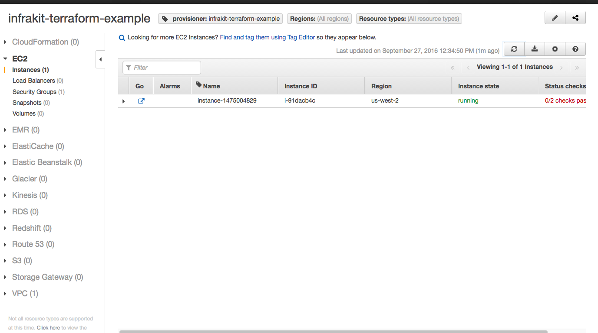
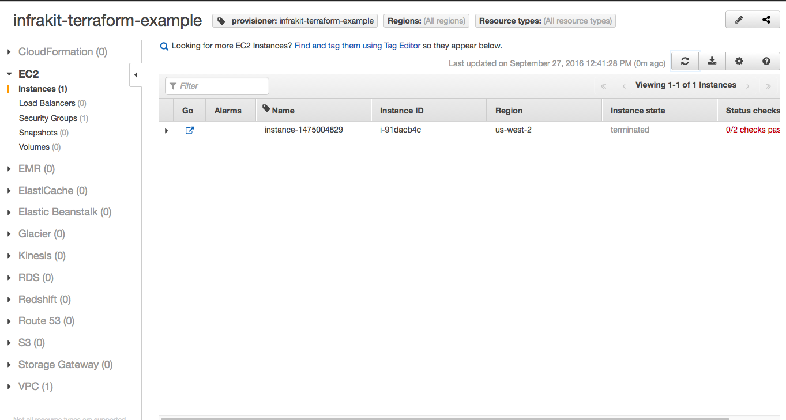

InfraKit Instance Plugin - Terraform
=====================================

This is a proof of concept Instance Plugin based on [Terraform](https://www.terraform.io).
In this concept, InfraKit provides the active group management while Terraform performs the
functions of resource provisioning.

This poc is adapted from the [`aws-two-tier`](https://github.com/hashicorp/terraform/tree/master/examples/aws-two-tier) example from the Terraform project.
There are some minor changes:

  + Variables that required on-screen user interaction (for setting public keys) have been removed
  and replaced with the `key_name` parameter in the provisioning config.
  + The ELB has been removed to keep the example simple -- registration of backends for ELB is
  coming in the future.
  + Removed the output variables which depended on the ELB.

The entire integration can be seen in the file [`plugin.go`](./plugin.go).  Some interesting points:

  + Provisioning via Terraform is simply creating a `.tf.json` file on disk and calling `terraform apply`.
  + The plugin auto-generates names for resources so user doesn't have to.
  + Describing the instances parses the `.tfstate` file (which is JSON).  We scan for the `modules` and
  `resources` sections and extract tags of resources that we created.
  + Destroying an instance is simply removing the `.tf.json` file and calling `terraform apply`.

## Configuration

This directory contains a `main.tf` that builds a VPC with subnet on AWS.  EC2 instances
(or `aws_instance` resource) are then added to the config as separate files when the plugin provisions
the resource.  For an EC2 instance this is a valid `.tf.json`:

```
{
    "resource": {
      "aws_instance": {
        "instance-1474957906": {
          "ami": "${lookup(var.aws_amis, var.aws_region)}",
          "instance_type": "m1.small",
          "key_name": "PUBKEY",
          "subnet_id": "${aws_subnet.default.id}",
          "tags": {
            "InstancePlugin": "terraform",
            "Tier": "web",
            "other": "values"
          },
          "user_data": "#!/bin/sh; echo 'hello world'",
          "vpc_security_group_ids": [
            "${aws_security_group.default.id}"
          ],
          "connection": {
            "user": "ubuntu"
          }
        }
      }
    }
  }
```

Terraform's configuration schema requires user assignment of names for individual resources, while
InfraKit operates on groups of them.  So we changed the JSON format slightly to require only the
resource type name (e.g. `aws_instance`).  This is the spec for the instance plugin:

```
{
    "Properties" : {
        "type" : "aws_instance",
        "value" : {
            "ami" : "${lookup(var.aws_amis, var.aws_region)}",
            "instance_type" : "m1.small",
            "key_name": "PUBKEY",
            "vpc_security_group_ids" : ["${aws_security_group.default.id}"],
            "subnet_id": "${aws_subnet.default.id}",
            "tags" :  {
                "Tier" : "web",
                "InstancePlugin" : "terraform"
            },
            "connection" : {
                "user" : "ubuntu"
            }
        }
    },
    "Tags" : {
        "other" : "values"
    },
    "Init" : "#!/bin/sh; sudo apt-get -y update; sudo apt-get -y install nginx; sudo service nginx start"
}
```

For validation of input, the plugin only checks for validity of the JSON blob in the `Properties` field
above.  Note that there are two properties of importance: `type` and `value`.  `type` is the resource
type in terraform (in this case `aws_instance`, but can also be other resource types, as long as it's
something that makes sense with the environment provisioned in `main.tf`.

When provisioning, the plugin assigns a name first and then generates a valid `tf.json`.


## Building

When you do `make -k all` in the top level directory, the CLI binary will be built and can be
found as `./infrakit/cli` from the project's top level directory.

## Usage

```
$ infrakit/terraform -h
Terraform instance plugin

Usage:
  infrakit/terraform [flags]
  infrakit/terraform [command]

Available Commands:
  version     print build version information

Flags:
      --dir string      Dir for storing the files (default "/var/folders/rq/g0cj3y7n511c10p2kbz5q33w0000gn/T/")
      --listen string   listen address (unix or tcp) for the control endpoint (default "unix:///run/infrakit/plugins/instance-terraform.sock")
      --log int         Logging level. 0 is least verbose. Max is 5 (default 4)

Use "infrakit/terraform [command] --help" for more information about a command.
```

The plugin requires a `dir` directory that will be used to contain the `tfstate` and `tf.json`
files.  It also checks to make sure it can call `terraform`.
Install Terraform [here](https://www.terraform.io/downloads.html) if you haven't done so.

As usual, you can give this plugin a different name by the URL (`unix:///plugins/dir/name.sock`)
when starting the plugin.  However you name it, it is still an InstancePlugin:

```
$ infrakit/terraform version
{
    "name": "TerraformInstance",
    "revision": "5999abffa5c10d4c9b9953459829dadea93d7ba4",
    "type": "infrakit.InstancePlugin/1.0",
    "version": "5999abf"
  }
```

### Default Directory for Plugin Discovery

All InfraKit plugins will by default open the unix socket located at `/run/infrakit/plugins`.
Make sure this directory exists on your host:

```
mkdir -p /run/infrakit/plugins
chmod 777 /run/infrakit/plugins
```

See the [CLI Doc](/cmd/cli/README.md) for details on accessing the instance plugin via CLI.

## Using

Start the plugin:

```
$ infrakit/terraform --log 5 --dir=./example/instance/terraform/aws-two-tier/
INFO[0000] Starting plugin
INFO[0000] Listening on: unix:///run/infrakit/plugins/instance-terraform.sock
DEBU[0000] terraform instance plugin. dir= ./example/instance/terraform/aws-two-tier/
INFO[0000] listener protocol= unix addr= /run/infrakit/plugins/instance-terraform.sock err= <nil>
```

Check that you can see it:

```
$ infrakit/cli plugin ls
Plugins:
NAME                	LISTEN
instance-terraform  	unix:///run/infrakit/plugins/instance-terraform.sock
group               	unix:///run/infrakit/plugins/group.sock
instance-file       	unix:///run/infrakit/plugins/instance-file.sock
```

Now lets try to validate something.  Instead of reading from stdin we are loading from a file
to avoid problems with bad bash substitution beacuse Terrafrom configs use `$` to indicate variables.

```
$ cat example/instance/terraform/aws-two-tier/instance-plugin-properties.json
{
    "type" : "aws_instance",
    "value" : {
        "ami" : "${lookup(var.aws_amis, var.aws_region)}",
        "instance_type" : "m1.small",
        "key_name": "PUBKEY",
        "vpc_security_group_ids" : ["${aws_security_group.default.id}"],
        "subnet_id": "${aws_subnet.default.id}",
        "tags" :  {
            "Tier" : "web",
            "InstancePlugin" : "terraform"
        },
        "connection" : {
            "user" : "ubuntu"
        }
    }
}
$ infrakit/cli instance --name instance-terraform validate example/instance/terraform/aws-two-tier/instance-plugin-properties.json
validate:ok
```

Now we can provision:

```
$ cat example/instance/terraform/aws-two-tier/instance-plugin-spec.json
{
    "Properties" : {
        "type" : "aws_instance",
        "value" : {
            "ami" : "${lookup(var.aws_amis, var.aws_region)}",
            "instance_type" : "m1.small",
            "key_name": "PUBKEY",
            "vpc_security_group_ids" : ["${aws_security_group.default.id}"],
            "subnet_id": "${aws_subnet.default.id}",
            "tags" :  {
                "Tier" : "web",
                "InstancePlugin" : "terraform"
            },
            "connection" : {
                "user" : "ubuntu"
            }
        }
    },
    "Tags" : {
        "other" : "values"
    },
    "Init" : "#!/bin/sh; sudo apt-get -y update; sudo apt-get -y install nginx; sudo service nginx start"
}
$ infrakit/cli instance --name instance-terraform provision example/instance/terraform/aws-two-tier/instance-plugin-spec.json
instance-1475004829
```

Now list them.

```
$ infrakit/cli instance --name instance-terraform describe
ID                            	LOGICAL                       	TAGS
instance-1475004829           	  -                           	other=values,provisioner=infrakit-terraform-example,InstancePlugin=terraform,Name=instance-1475004829,Tier=web
```

You should verify that the instances are indeed created in the AWS Console.
In AWS Console you can filter by tag `provisioner` with value `infrakit-terraform-example`:



Now destroy the instance:

```
$ infrakit/cli instance --name instance-terraform destroy instance-1475004829
destroyed instance-1475004829
$ infrakit/cli instance --name instance-terraform describe
ID                            	LOGICAL                       	TAGS
```


