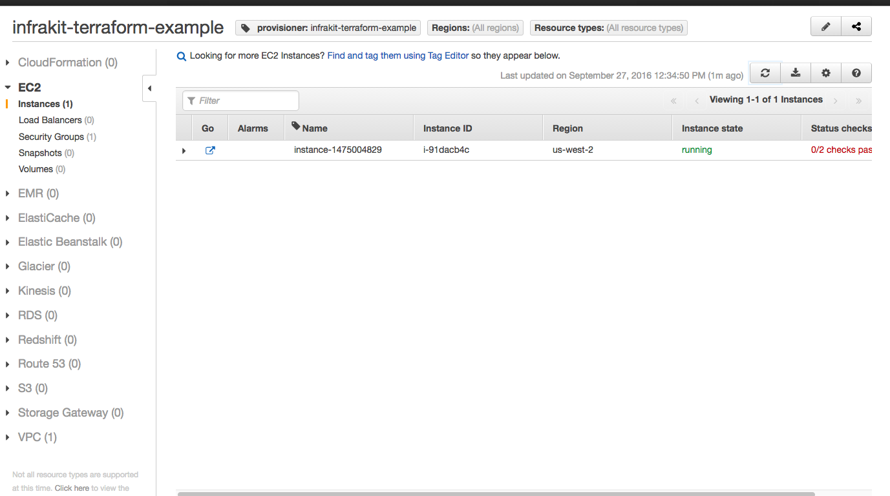
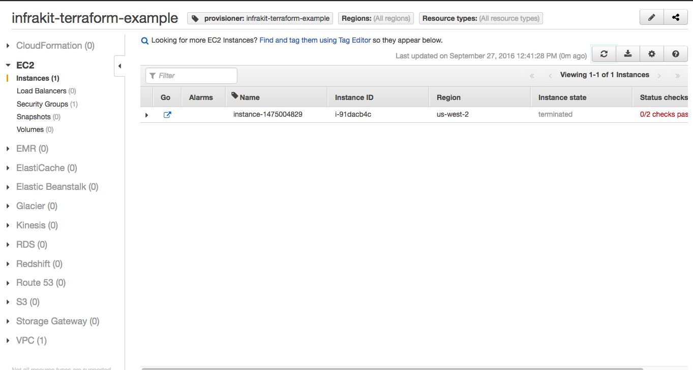

InfraKit Instance Plugin - Terraform
=====================================

A [reference](/README.md#reference-implementations) implementation of an Instance Plugin that creates machines
using [Terraform](https://www.terraform.io).  In this concept, InfraKit provides the active group management while
Terraform performs the functions of resource provisioning.

This poc is adapted from the [`aws-two-tier`](https://github.com/hashicorp/terraform/tree/master/examples/aws-two-tier)
example from the Terraform project. There are some minor changes:

  + Variables that required on-screen user interaction (for setting public keys) have been removed
  and replaced with the `key_name` parameter in the provisioning config.
  + The ELB has been removed to keep the example simple -- registration of backends for ELB is
  coming in the future.
  + Removed the output variables which depended on the ELB.

The entire integration can be seen in the file [`plugin.go`](plugin.go).  Some interesting points:

  + Provisioning via Terraform is simply creating a `.tf.json` file on disk and calling `terraform apply`.
  + `terraform apply` uses a local lock file to make sure only one process is access and updating the
  `.tfstate` file.  This is to avoid concurrent access which can sometimes corrupt the state file.
  In the end, the design is simplified:  we only need to write the files to disk and a dedicated
  goroutine continuously calls `terraform apply`.  
  + The plugin auto-generates names for resources so user doesn't have to.
  + Destroying an instance is simply removing the `.tf.json` file and calling `terraform apply`.
  + Describing instances simply go through all the `instance-X.tf.json` files on disk and returns them
  as the result. This is a pretty simplistic integration but it is more correct than writing files
  and then reading the `tfstate` file.  The generated tf json file instances are essentially
  "promises" that terraform will eventually provision. A tighter integration is worth investigation.

[Here](cattle_demo.md) is a simple demo of using Terraform with group and Vanilla plugins.

## Configuration

This directory contains a `main.tf` that builds a VPC with subnet on AWS.  EC2 instances
(or `aws_instance` resource) are then added to the config as separate files when the plugin provisions
the resource.  For an EC2 instance this is a valid `.tf.json`:

```json
{
    "resource": {
      "aws_instance": {
        "instance-1474957906": {
          "ami": "${lookup(var.aws_amis, var.aws_region)}",
          "instance_type": "m1.small",
          "key_name": "PUBKEY",
          "subnet_id": "${aws_subnet.default.id}",
          "tags": {
            "InstancePlugin": "terraform",
            "Tier": "web",
            "other": "values"
          },
          "user_data": "#!/bin/sh; echo 'hello world'",
          "vpc_security_group_ids": [
            "${aws_security_group.default.id}"
          ],
          "connection": {
            "user": "ubuntu"
          }
        }
      }
    }
  }
```

Terraform's configuration schema requires user assignment of names for individual resources, while
InfraKit operates on groups of them.  So we changed the JSON format slightly to require only the
resource type name (e.g. `aws_instance`).  This is the spec for the instance plugin:

```json
{
    "Properties" : {
      "resource" : {
        "aws_instance": {
          "ami" : "${lookup(var.aws_amis, var.aws_region)}",
          "instance_type" : "m1.small",
          "key_name": "PUBKEY",
          "vpc_security_group_ids" : ["${aws_security_group.default.id}"],
          "subnet_id": "${aws_subnet.default.id}",
          "tags" :  {
              "Tier" : "web",
              "InstancePlugin" : "terraform"
          },
          "connection" : {
              "user" : "ubuntu"
          }
        }
      }
    },
    "Tags" : {
        "other" : "values"
    },
    "Init" : "#!/bin/sh; sudo apt-get -y update; sudo apt-get -y install nginx; sudo service nginx start"
}
```

For validation of input, the plugin only checks for validity of the JSON blob in the `Properties` field
above.  Note that there are two properties of importance: `type` and `value`.  `type` is the resource
type in terraform (in this case `aws_instance`, but can also be other resource types, as long as it's
something that makes sense with the environment provisioned in `main.tf`.

When provisioning, the plugin assigns a name first and then generates a valid `tf.json`.  `terraform apply`
is run continuously in the background so as soon as new files are deposited, Terraform will provision
and update its state.  When an instance is removed, Terraform will do the same by destroying the instance
and update its state.


## Runtime Options

The plugin support the following `Launch` `inproc` `Options`:

* `Dir`: Directory that will be used to contain the `tfstate` and `tf.json` files
* `PollInterval`: Frequency that `terraform apply` is invoked; note that it is only invoked on the leader
manager (unless `standalone=true`, see below)
* `Standalone`: If `true` then manager leadership is not verified prior to invoking `terraform apply`
(default is `false`)
* `Envs`: Array of environment variables to include when invoking the `terraform` commands

The plugin also supports importing existing resources into terraform; this can be used to import the
initial manager into terraform. Once the resource is imported into terraform, a corresponding `.tf.json`
file is also created. The following optional fields are used for this purpose:
* `ImportGroupSpecURL`: The group specification URL that contains a nested instance specification; the
`.tf.json` file for the imported resource contains the properties in the instance specification
* `ImportGroupID`: Optional group ID that the imported resource should be tagged with
* `ImportResources`: An array of resources to import into terraform, these resources must correspond
with those in the instance specification (nested in the group specification). Each element contains:
  * `ResourceType`: The terraform resource type being imported
  * `ResourceID`: The resource ID being imported
  * `ResourceName`: The terraform resource name to assign to the the resource being imported; this value
  must match the name in the instance spec (required if there is more then one resource of the same type
  in the specification)
  * `ExcludePropIDs`: An array of property IDs in the instance specification that should _not_ be
  included in the corresponding `.tf.json` file

For example:

```
{
  "Key" : "terraform",
  "Launch" : {
    "inproc": {
      "Kind" : "terraform",
      "Options" : {
        "Dir": "/infrakit",
        "PollInterval": "60s",
        "Standalone": false,
        "ImportGroupSpecURL" : "file://defn-mgr-group.json",
        "ImportGroupID": "managers",
        "ImportResources": [
          {
            "ResourceType": "ibm_compute_vm_instance",
            "ResourceID": "123456"
          },
          {
            "ResourceType": "ibm_subnet",
            "ResourceID": "abc-123-xyz"
          }
        ]
      }
    }
  }
}
```

## Running

Begin by building plugin [binaries](/README.md#binaries).

The plugin also checks to make sure it can call `terraform`. Install Terraform [here](https://www.terraform.io/downloads.html) if you haven't done so.

See the [CLI Doc](/cmd/infrakit/README.md) for details on accessing the instance plugin via CLI.

Start the plugin:

```shell
$ build/infrakit-instance-terraform --dir=./pkg/provider/terraform/instance/aws-two-tier/
INFO[0000] Listening at: ~/.infrakit/plugins/instance-terraform
```

Be sure to verify that the plugin is [discoverable](/cmd/infrakit/README.md#list-plugins).

Now lets try to validate something.  Instead of reading from stdin we are loading from a file
to avoid problems with bad bash substitution beacuse Terrafrom configs use `$` to indicate variables.

```shell
$ cat pkg/provider/terraform/instance/aws-two-tier/instance-plugin-properties.json
{
    "type" : "aws_instance",
    "value" : {
        "ami" : "${lookup(var.aws_amis, var.aws_region)}",
        "instance_type" : "m1.small",
        "key_name": "PUBKEY",
        "vpc_security_group_ids" : ["${aws_security_group.default.id}"],
        "subnet_id": "${aws_subnet.default.id}",
        "tags" :  {
            "Tier" : "web",
            "InstancePlugin" : "terraform"
        },
        "connection" : {
            "user" : "ubuntu"
        }
    }
}
$ build/infrakit instance --name instance-terraform validate pkg/provider/terraform/instance/aws-two-tier/instance-plugin-properties.json
validate:ok
```

Now we can provision:

```shell
$ cat pkg/provider/terraform/instance/aws-two-tier/instance-plugin-spec.json
{
    "Properties" : {
        "type" : "aws_instance",
        "value" : {
            "ami" : "${lookup(var.aws_amis, var.aws_region)}",
            "instance_type" : "m1.small",
            "key_name": "PUBKEY",
            "vpc_security_group_ids" : ["${aws_security_group.default.id}"],
            "subnet_id": "${aws_subnet.default.id}",
            "tags" :  {
                "Tier" : "web",
                "InstancePlugin" : "terraform"
            },
            "connection" : {
                "user" : "ubuntu"
            }
        }
    },
    "Tags" : {
        "other" : "values"
    },
    "Init" : "#!/bin/sh; sudo apt-get -y update; sudo apt-get -y install nginx; sudo service nginx start"
}
$ build/infrakit instance --name instance-terraform provision pkg/provider/terraform/instance/aws-two-tier/instance-plugin-spec.json
instance-1475004829
```

Now list them.

```shell
$ build/infrakit instance --name instance-terraform describe
ID                            	LOGICAL                       	TAGS
instance-1475004829           	  -                           	other=values,provisioner=infrakit-terraform-example,InstancePlugin=terraform,Name=instance-1475004829,Tier=web
```

You should verify that the instances are indeed created in the AWS Console.
In AWS Console you can filter by tag `provisioner` with value `infrakit-terraform-example`:



Now destroy the instance:

```shell
$ build/infrakit instance --name instance-terraform destroy instance-1475004829
destroyed instance-1475004829
$ build/infrakit instance --name instance-terraform describe
ID                            	LOGICAL                       	TAGS
```



## Resource Scoping

The most basic instance specification contains a VM definition, `Provision` is executed on this
specification multiple times when creating a group of similar resources. But what about resources
that need to survive rolling updates? Or resources that are shared across an entire group? In order
to address these infrastructure needs, the terraform instance plugin has a "scoping" concept with
the following options:

- **Default:** Resources defined with this scope have a 1-to-1 relationship with the VM and
a _tightly coupled_ lifecyle
- **Dedicated:**  Resources defined with this scope have a 1-to-1 relationship with the VM
and a _loosly coupled_ lifecycle
- **Global:** Resources defined with this scope are _not coupled_ with the lifecycle of any
specific VM

The implications of these scoping options with group actions are highlighted below:

| Scope     | Group Create | Rolling Update    | Scale Up  | Scale Down | Group Destroy |
| ---       | ---          | ---               | ---       | ---        | ---           |
| Default   | -            | Destroy/Provision | Provision | Destroy    | -             |
| Dedicated | -            | -                 | Provision | Destroy    | -             |
| Global    | Provision    | -                 | -         | -          | Destroy       |

The scope defined using the `@scope` property in the terraform resource definition. The values
of this property are as follows:

- **Default**: `@default`. All resources are of this type if the `@scope` property is omitted.
- **Dedicated**: `@dedicated-<id>`. The `<id>` value is used as a dedicated scope identifier and, if
omitted, defaults to `default`. The recommendation is to use the group ID as the dedicated scope ID.
- **Global**: Any other value.

### Logical ID (pets) example

For example, the following defines a manager group with 3 members, globally shared NFS, and dedicated
block storage.

```json
{
  "ID": "managers",
  "Properties": {
    "Allocation": {
      "LogicalIDs": [
        "mgr1", "mgr2", "mgr3"
      ]
    },
    "Instance": {
      "Plugin": "instance-terraform",
      "Properties": {
        "resource": {
          "ibm_compute_vm_instance": {
            "host": {
              ...
            }
          },
          "ibm_storage_block": {
            "my_block_storage": {
              "@scope": "@dedicated-managers",
              ...
            }
          },
          "ibm_storage_file": {
            "my_file_storage": {
              "@scope": "managers",
              ...
            }
          }
        }
      }
    },
    "Flavor": {
      "Plugin": "flavor-swarm/worker",
      "Properties": {
        "Init": [
          "echo \"NFS ID: \"${ibm_storage_file.managers-my_file_storage.id}\"",
          "echo \"Block storage ID: \"${ibm_storage_block.managers-{{ var \"/self/logicalId\" }}-my_block_storage.id}\""
        ]
      }
    }
  }
}
```
The dedicated/global files and resources for a group specification **with logical IDs** adhere to the following format:

| Type      | Filename                                  | Terraform Resource Path                               |
| ---       | ---                                       | ---                                                   |
| Dedicated | `<scopeID>_dedicated_<logicalID>.tf.json` | `<resourceType>.<scopeID>-<logicalID>-<resourceName>` |
| Global    | `<scopeValue>_global.tf.json`             | `<resourceType>.<scopeValue>-<resourceName>`          |

For example, the specific resources created by the above specification are:

| Resource        | Filename                          | Terraform Resource Path                            |
| ---             | ---                               | ---                                                |
| Manager-1 VM    | `instance-xxx1.tf.json`           | `ibm_compute_vm_instance.instance-xxx1`            |
| Manager-2 VM    | `instance-xxx2.tf.json`           | `ibm_compute_vm_instance.instance-xxx2`            |
| Manager-3 VM    | `instance-xxx3.tf.json`           | `ibm_compute_vm_instance.instance-xxx3`            |
| Manager-1 Block | `managers_dedicated_mgr1.tf.json` | `ibm_storage_block.managers-mgr1-my_block_storage` |
| Manager-2 Block | `managers_dedicated_mgr2.tf.json` | `ibm_storage_block.managers-mgr2-my_block_storage` |
| Manager-3 Block | `managers_dedicated_mgr3.tf.json` | `ibm_storage_block.managers-mgr3-my_block_storage` |
| Global NFS      | `managers_global.tf.json`         | `ibm_storage_file.managers-my_file_storage`        |

Dedicated resources for VMs **with a logical ID** assigned have the logical ID in the resource name.
Note that the template variable `/self/logicalId` is used in the `Init` script to dynamically determine
the specific instance in the quorum group that is being provisioned.

### Cattle example

In the first example, the dedicated resources have a predictable naming scheme since logical IDs are
supplied. The following example shows how a similarly defined scaling group is handled:

```json
{
  "ID": "workers",
  "Properties": {
    "Allocation": {
      "Size": 3
    },
    "Instance": {
      "Plugin": "instance-terraform",
      "Properties": {
        "resource": {
          "ibm_compute_vm_instance": {
            "host": {
              ...
            }
          },
          "ibm_storage_block": {
            "my_block_storage": {
              "@scope": "@dedicated-workers",
              ...
            }
          },
          "ibm_storage_file": {
            "my_file_storage": {
              "@scope": "workers",
              ...
            }
          }
        }
      }
    },
    "Flavor": {
      "Plugin": "flavor-swarm/worker",
      "Properties": {
        "Init": [
          "echo \"NFS ID: \"${ibm_storage_file.workers-my_file_storage.id}\"",
          "echo \"Block storage ID: \"${ibm_storage_block.workers-{{ var \"/self/dedicated/attachId\" }}-my_block_storage.id}\""
        ]
      }
    }
  }
}
```
The dedicated/global files and resources for a group specification **without logical IDs** adhere to the following format:

| Type      | Filename                              | Terraform Resource Path                               |
| ---       | ---                                   | ---                                                   |
| Dedicated | `<scopeID>_dedicated_<index>.tf.json` | `<resourceType>.<scopeID>-<index>-<resourceName>` |
| Global    | `<scopeValue>_global.tf.json`         | `<resourceType>.<scopeValue>-<resourceName>`          |

For example, the specific resources created by the above specification are:

| Resource       | Filename                      | Terraform Resource Path                        |
| ---            | ---                           | ---                                            |
| Worker-1 VM    | `instance-yyy1.tf.json`       | `ibm_compute_vm_instance.instance-yyy1`        |
| Worker-2 VM    | `instance-yyy2.tf.json`       | `ibm_compute_vm_instance.instance-yyy2`        |
| Worker-3 VM    | `instance-yyy3.tf.json`       | `ibm_compute_vm_instance.instance-yyy3`        |
| Worker-1 Block | `workers_dedicated_1.tf.json` | `ibm_storage_block.workers-1-my_block_storage` |
| Worker-2 Block | `workers_dedicated_2.tf.json` | `ibm_storage_block.workers-2-my_block_storage` |
| Worker-3 Block | `workers_dedicated_3.tf.json` | `ibm_storage_block.workers-3-my_block_storage` |
| Global NFS     | `workers_global.tf.json`      | `ibm_storage_file.workers-my_file_storage`     |

Dedicated resources for VMs **without a logical ID** assigned are not as easily mapped to the as those with
a logical ID; the file and resource name has an index value that increments as the group scales. The template
variable `/self/dedicated/attachId` is used in the `Init` script to dynamically determine the dedicated resource
name that is associated with the instance.

Next, assume that a rolling update was done on this group, resulting in all of `yyy` VM instances being
replaced with `zzz` instances. After the update is completed the resources look like:

| Resource       | Filename                      | Terraform Resource Path                        |
| ---            | ---                           | ---                                            |
| Worker-1 VM    | `instance-zzz1.tf.json`       | `ibm_compute_vm_instance.instance-zzz1`        |
| Worker-2 VM    | `instance-zzz2.tf.json`       | `ibm_compute_vm_instance.instance-zzz2`        |
| Worker-3 VM    | `instance-zzz3.tf.json`       | `ibm_compute_vm_instance.instance-zzz3`        |
| Worker-1 Block | `workers_dedicated_1.tf.json` | `ibm_storage_block.workers-1-my_block_storage` |
| Worker-2 Block | `workers_dedicated_2.tf.json` | `ibm_storage_block.workers-2-my_block_storage` |
| Worker-3 Block | `workers_dedicated_3.tf.json` | `ibm_storage_block.workers-3-my_block_storage` |
| Global NFS     | `workers_global.tf.json`      | `ibm_storage_file.workers-my_file_storage`     |

During provision, the plugin determines an orphaned dedicated block storage resource and links it with the
new instance.

## Orphan Detection

Terraform tracks the state of resources (corresponding to `.tf.json` files) in the `.tfstate` file.

In order to detect resources that have been removed outside of Infrakit (for example, if an instance is
removed from the Cloud provider natively), the terraform instance plugin creates an intermediate
`tf.json.new` file on `Provision`; these files are **not processed** during a `terraform apply`. However,
the terraform instance plugin **does process**  both `tf.json` and `tf.json.new` files in the
`DescribeInstances`, `Destroy`, and `Label` functions.

The terraform instance plugin has a dedicated goroutine (running at a configurable frequency) that
executes the following:

1. Acquires a file lock (protects access to all `tf.json` and `tf.json.new` files)
2. Executes `terraform refresh` to update the `.tfstate` file
3. Executes `terraform state list` to list all resources in the state file
4. Removes any `tf.json` file that corresponds to an instance that is **not** in the state file
5. Renames all `tf.json.new` files to `tf.json` files so that a `terraform apply` will process them
6. Releases file lock (from step 1)
7. Executes `terraform apply -no-refresh`

By naming new files with the `.tf.json.new` suffix in the `Provision` flow, the plugin can differentiate
between orphaned resources and those queued up for creation.
